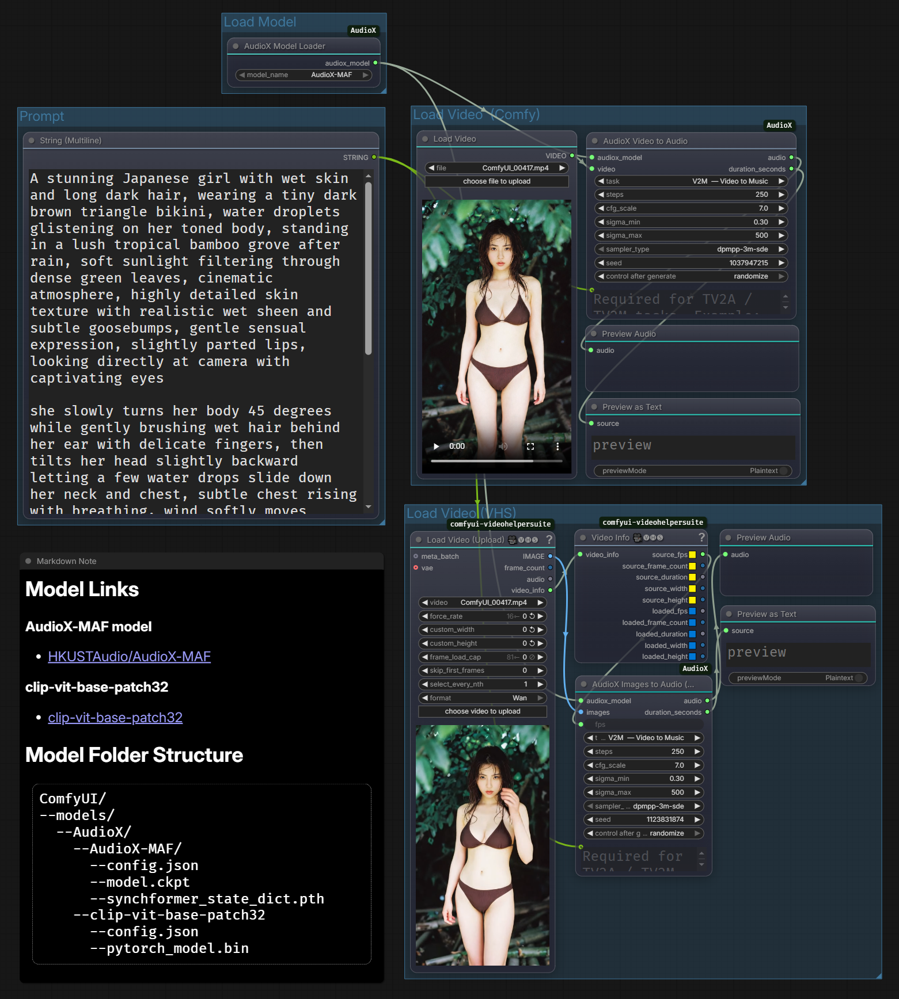

# ComfyUI-AudioX

ComfyUI custom nodes for **AudioX** — generate sound effects and background music from video, powered by [HKUSTAudio/AudioX](https://github.com/ZeyueT/AudioX).

Great thanks to [ZeyueT/AudioX](https://github.com/ZeyueT/AudioX).

---

## Sample Workflow

See [`examples/AudioX_sample_workflow.json`](examples/AudioX_sample_workflow.json).

The workflow contains two parallel paths:

```
[ComfyUI Load Video] ──► VIDEO ──► [AudioX Video to Audio] ──► AUDIO ──► [Preview Audio]

[VHS Load Video] ──► IMAGE ──► [AudioX Images to Audio (VHS)] ──► AUDIO ──► [Preview Audio]
                  fps ↗ (from VHS Video Info)
```

Import it via **ComfyUI → Load → select the JSON file, or find it in ComfyUI's template browser.**



---

## Nodes

| Node | Input | Output | Description |
|------|-------|--------|-------------|
| **AudioX Model Loader** | — | `AUDIOX_MODEL` | Load a local AudioX model |
| **AudioX Video to Audio** | `VIDEO` | `AUDIO` | Generate audio from ComfyUI's Load Video node |
| **AudioX Images to Audio (VHS)** | `IMAGE` | `AUDIO` | Generate audio from frame sequences (VideoHelperSuite etc.) |

## Supported Models

| Model | Notes |
|-------|-------|
| [AudioX-MAF](https://huggingface.co/HKUSTAudio/AudioX-MAF) | **Recommended** — best quality, uses Synchformer visual encoder |
| [AudioX-MAF-MMDiT](https://huggingface.co/HKUSTAudio/AudioX-MAF-MMDiT) | MMDiT variant (in progress, not tested yet) | 
| [AudioX](https://huggingface.co/HKUSTAudio/AudioX) | Base model, no Synchformer (in progress, not tested yet)| 

---

## Tasks

### Install from ComfyUI Manager Extensions
Search 'ComfyUI-AudioX' in ComfyUI Manager Extensions.

All dependencies will be installed automatically. If you encounter numpy conflicts after installation, see the troubleshooting section below.

### Install manually:

### 1 — Clone the node

```bash
cd ComfyUI/custom_nodes
git clone https://github.com/jinxishe/ComfyUI-AudioX.git
```

### 2 — Install dependencies

```bash
cd ComfyUI-AudioX
pip install -r requirements.txt
```

> **Note:** `torch`, `torchvision`, and `torchaudio` are **not** in
> `requirements.txt` because ComfyUI already manages them.

### 3 — Download models

Create the directory structure under `ComfyUI/models/AudioX/`:

```
ComfyUI/models/AudioX/
├── clip-vit-base-patch32/       ← shared CLIP (download once)
│   ├── config.json
│   └── pytorch_model.bin
└── AudioX-MAF/
    ├── config.json
    ├── model.ckpt
    └── synchformer_state_dict.pth
```

```bash
# AudioX-MAF (recommended)
huggingface-cli download HKUSTAudio/AudioX-MAF \
    --local-dir "ComfyUI/models/AudioX/AudioX-MAF"

# Shared CLIP model (avoids repeated downloads)
huggingface-cli download openai/clip-vit-base-patch32 \
    --local-dir "ComfyUI/models/AudioX/clip-vit-base-patch32"
```

Restart ComfyUI after downloading.

---

## Tasks

| Task | Description | `custom_prompt` required? |
|------|-------------|:---:|
| V2A — Video to Audio | Generate sound effects matching the video | No |
| V2M — Video to Music | Generate background music matching the video | No |
| TV2A — Text + Video to Audio | Guide sound effects with a text prompt | **Yes** |
| TV2M — Text + Video to Music | Guide music generation with a text prompt | **Yes** |

---

## Parameters

| Parameter | Default | Description |
|-----------|---------|-------------|
| `steps` | 250 | Diffusion sampling steps. Higher = better quality, slower |
| `cfg_scale` | 7.0 | Classifier-free guidance scale |
| `sigma_min` | 0.3 | Minimum noise level |
| `sigma_max` | 500 | Maximum noise level |
| `sampler_type` | `dpmpp-3m-sde` | Sampling algorithm |
| `seed` | -1 | Fixed seed for reproducibility; -1 = random |

---

## Notes

- Models are trained on **10-second clips**. Videos shorter than 10 s are padded
  with the last frame; the output audio is trimmed to the actual video duration.
- GPU memory: ~16 GB VRAM recommended (tested on RTX 4060 Ti 16 GB).
- The `AudioX Images to Audio (VHS)` node requires **ffmpeg** on the system PATH
  to assemble frames into a temporary MP4.
- CLIP `UNEXPECTED` key warnings in the log are harmless — they appear because
  `CLIPVisionModelWithProjection` loads only the vision head from a full CLIP checkpoint.
- **Tested on Python 3.12 and CU128**.

---

## Troubleshooting

### Dependency Conflicts

If you encounter dependency conflicts after installation:

**NumPy version conflict** (e.g., `dctorch requires numpy<2.0.0` or `opencv-python requires numpy>=2.0`):
```bash
# Upgrade numpy to latest version
pip install "numpy>=2.0.0"
```
This is safe — most packages work fine with numpy 2.x even if they specify older version constraints.

**Protobuf conflict** (`descript-audiotools requires protobuf<3.20`):
```bash
# Downgrade protobuf if needed
pip install "protobuf<3.20,>=3.9.2"
```

These dependency warnings from pip are usually safe to ignore if the nodes are working correctly.

---

## Credits

- Original model: [HKUSTAudio/AudioX](https://github.com/ZeyueT/AudioX) — HKUST Audio Lab
- Sampling: [k-diffusion](https://github.com/crowsonkb/k-diffusion) — Katherine Crowson
- Great thanks to [ZeyueT/AudioX](https://github.com/ZeyueT/AudioX).

## License

MIT — see [LICENSE](LICENSE)
